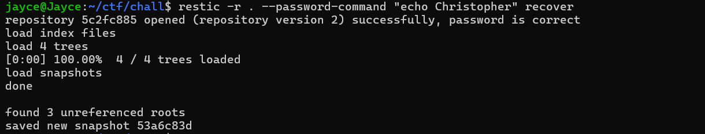
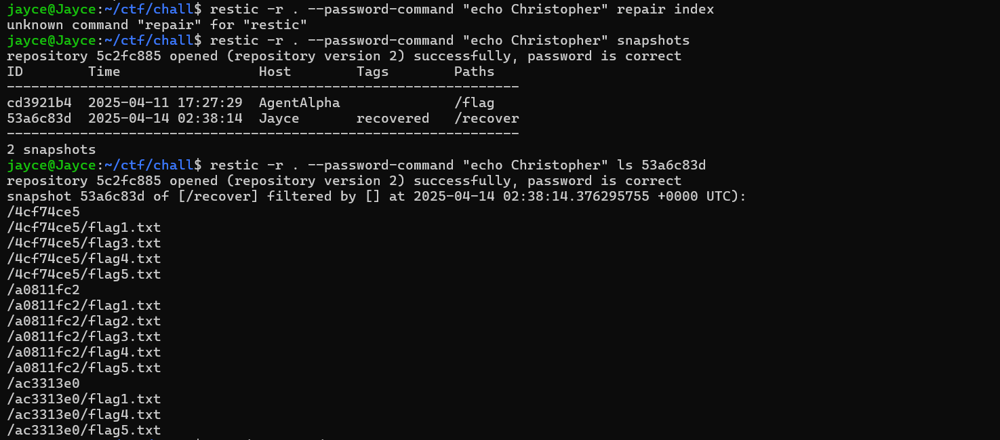

```bash
restic -r . --password-command "echo Christopher" dump 53a6c83d /ac3313e0/flag4.txt
restic -r . --password-command "echo Christopher" dump 53a6c83d /a0811fc2/flag1.txt
restic -r . --password-command "echo Christopher" dump 53a6c83d /a0811fc2/flag2.txt
restic -r . --password-command "echo Christopher" dump 53a6c83d /a0811fc2/flag3.txt
restic -r . --password-command "echo Christopher" dump 53a6c83d /a0811fc2/flag4.txt
restic -r . --password-command "echo Christopher" dump 53a6c83d /a0811fc2/flag5.txt
```

- Flag: `1753c{faked_my_own_death_to_save_the_flag}
`