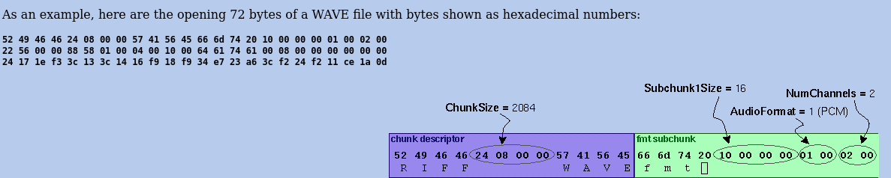
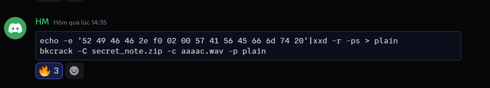
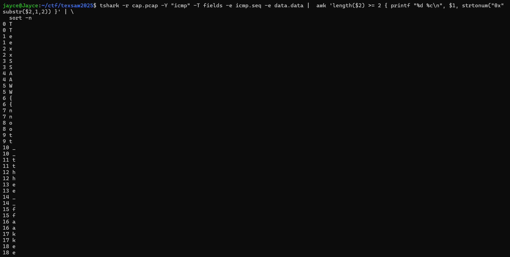

#### Hidden beneath the wavs

- Crack file `.zip` using bkcrack. We have infomation about this file:

    

- Hint in discord team -> Key -> unzip file `.wav`

    

- Crack result

    

- `TexSAW{Th3_s1l3nce_SH4ll_l3ad_TH3_W4y}`

#### Scrambled Packets

- ICMP packets in Pcap file

    

- `TexSAW{not_the_fake_one}`