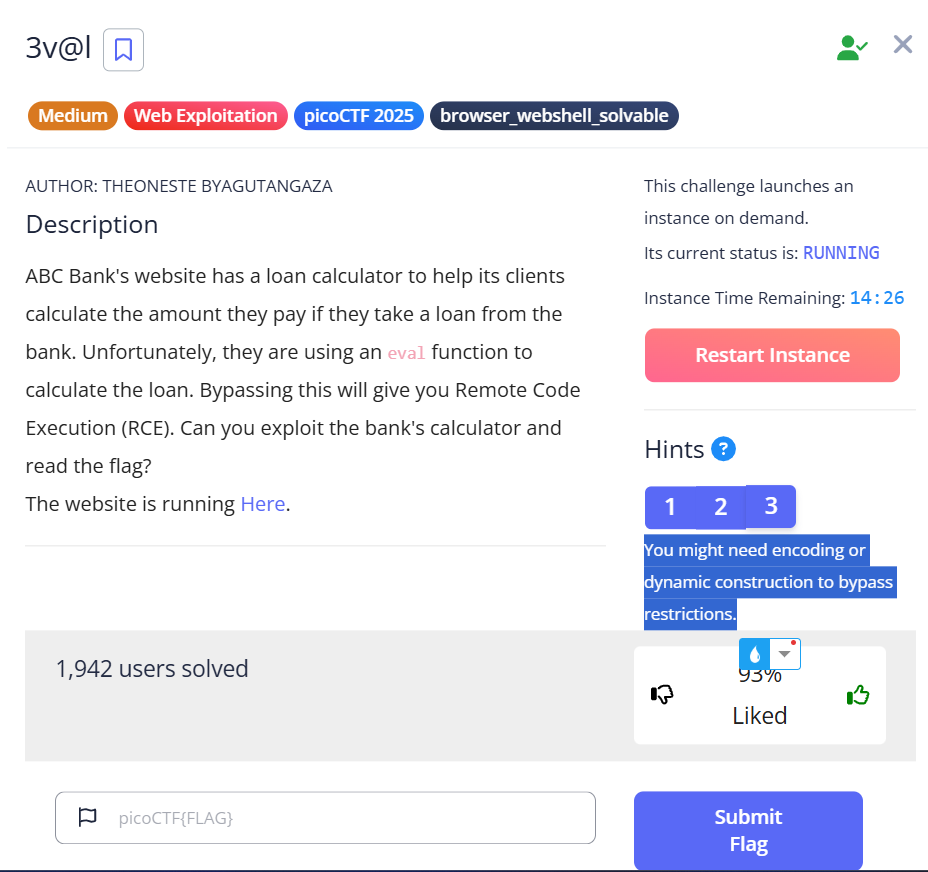
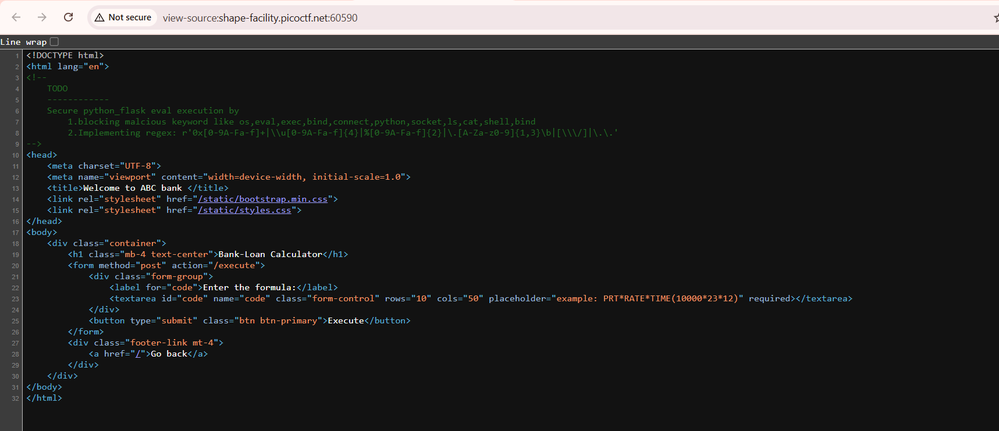

- Description

    ABC Bank's website has a loan calculator to help its clients calculate the amount they pay if they take a loan from the bank. Unfortunately, they are using an eval function to calculate the loan. Bypassing this will give you Remote Code Execution (RCE). Can you exploit the bank's calculator and read the flag?
    The website is running Here.

- Hints

    `1. Bypass regex`
    `2. The flag file is /flag.txt`
    `3. You might need encoding or dynamic construction to bypass restrictions.`

    

- View the source code, i see

    