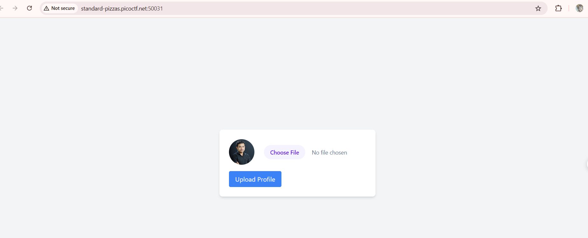
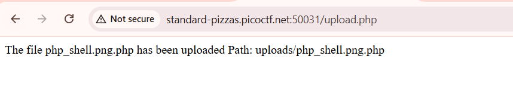
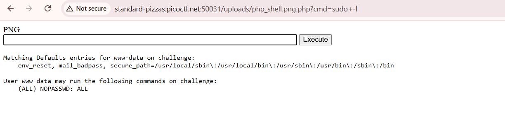
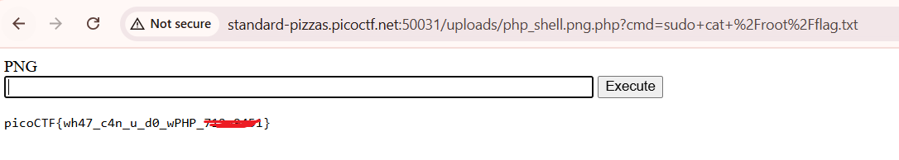

- Description

    A developer has added profile picture upload functionality to a website. However, the implementation is flawed, and it presents an opportunity for you. Your mission, should you choose to accept it, is to navigate to the provided web page and locate the file upload area. Your ultimate goal is to find the hidden flag located in the `/root` directory.
    Additional details will be available after launching your challenge instance.

- Hints

    `1. File upload was not sanitized`
    `2. Whenever you get a shell on a remote machine, check sudo -l`

    

- The site has a file upload feature, which immediately made me think of the `file upload vulnerability`.

    

    - So I uploaded a [webshell](/n0s4n1ty%201/php_shell.php.png)

    

    - Redirect it to the shell, I checked sudo -l to see what permissions might be

    

    `NOPASSWD: ALL` meaning I have full sudo rights without entering a password. Hints says the password is in `/root` and I read it with `sudo`

    
